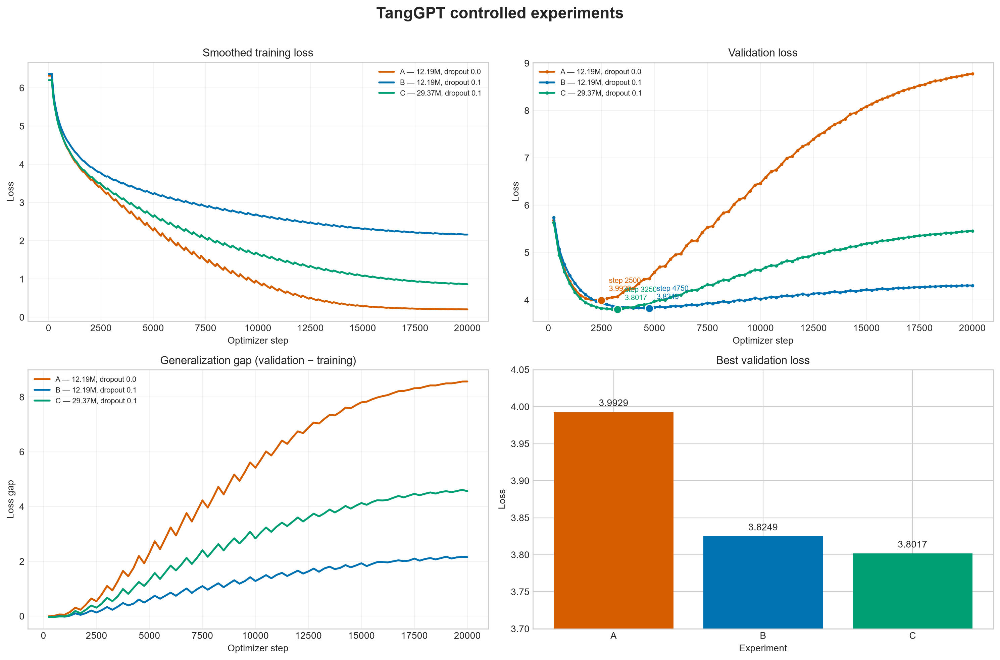

# TangGPT

这是我在学习 Transformer 和 PyTorch 时做的一个小项目。我的目标是不直接调用现成的大语言模型，而是自己从头搭建一个 Decoder-only Transformer，并尝试让它学习生成唐诗。

项目已经完成了从数据处理到正式训练的完整流程。我在单张 RTX 4090 上做了三组 20,000 步对照实验，比较了 Dropout 和模型规模对拟合情况的影响。训练结果、曲线和实验配置都保存在仓库中。

## 我为什么做这个项目

我之前对 Transformer 的理解主要停留在结构图和公式上，所以想通过这个项目把整个流程真正跑一遍，包括：

- 唐诗数据清洗和划分
- 从零实现 byte-level BPE tokenizer
- 实现 causal self-attention 和 Decoder block
- 编写训练、验证和 checkpoint 保存逻辑
- 用训练好的模型生成唐诗

这个项目主要是为了学习，代码和配置可能还有不少可以改进的地方。

## 目前实现的内容

模型部分包括：

- Token Embedding
- RMSNorm
- Rotary Position Embedding（RoPE）
- Multi-head Causal Self-Attention
- SwiGLU
- Pre-Norm 残差连接
- Tied Language Model Head

训练部分包括：

- AdamW 优化器
- Warmup + Cosine Learning Rate Decay
- 梯度累积和梯度裁剪
- CUDA 混合精度训练
- 验证集评估
- Checkpoint 保存和断点续训
- Temperature + Top-k 采样生成

## 项目结构

```text
TangGPT/
├── artifacts/       # tokenizer 文件
├── configs/         # 不同设备使用的训练配置
├── data/            # 数据来源说明和本地数据
├── learning/        # 学习过程中写的简化版本
├── results/         # 正式训练的曲线、指标和实验结论
├── scripts/         # 数据处理、训练和生成脚本
├── src/tanggpt/     # 模型和主要功能代码
└── tests/           # 单元测试
```

## 环境

- Python 3.10+
- PyTorch 2.1+
- 建议使用支持 CUDA 的 NVIDIA 显卡进行正式训练

安装项目：

```bash
pip install -e .
```

运行测试：

```bash
pytest
```

也可以先查看模型结构：

```bash
python scripts/inspect_model.py
```

## 数据准备

训练数据来自 [chinese-poetry/chinese-poetry](https://github.com/chinese-poetry/chinese-poetry)，使用的是其中的全唐诗数据。原项目采用 MIT License。

下载数据：

```bash
git clone --depth 1 --filter=blob:none --sparse \
  https://github.com/chinese-poetry/chinese-poetry.git \
  data/raw/chinese-poetry
git -C data/raw/chinese-poetry sparse-checkout set "全唐诗"
```

准备训练集、验证集和测试集：

```bash
python scripts/prepare_data.py
```

仓库里已经放了训练好的 `artifacts/tokenizer.json`。如果想重新训练 tokenizer，可以运行：

```bash
python scripts/train_tokenizer.py --vocab-size 4096
```

数据处理时会进行正文清洗、去重，并按照 98% / 1% / 1% 划分训练集、验证集和测试集。原始数据和训练 checkpoint 不会上传到 GitHub。

## 训练

在正式训练之前，可以先用很小的数据做一次 smoke test：

```bash
python scripts/train.py \
  --config configs/smoke.json \
  --run-dir runs/smoke \
  --train-limit 32 \
  --valid-limit 16
```

单张 RTX 4090 使用：

```bash
python scripts/train.py --config configs/server_4090.json
```

仓库还保留了正式对照实验使用的三份配置：

```text
configs/experiment_a_baseline.json  # 12.19M，dropout 0.0
configs/experiment_b_dropout.json   # 12.19M，dropout 0.1
configs/experiment_c_large.json     # 29.37M，dropout 0.1
```

我的 RTX 5060 Laptop 8GB 使用：

```bash
python scripts/train.py --config configs/local_5060_8gb.json
```

如果训练中断，可以从最近一次保存的位置继续：

```bash
python scripts/train.py \
  --config configs/server_4090.json \
  --resume runs/server_4090/last.pt
```

训练目录中，`last.pt` 用来恢复训练，`best.pt` 是验证 loss 最低的模型。

如果出现 CUDA out of memory，可以减小 `batch_size`，同时增加 `gradient_accumulation_steps`，尽量保持等效 batch size 不变。

## 生成唐诗

训练完成后可以运行：

```bash
python scripts/generate.py \
  --checkpoint runs/server_4090/best.pt \
  --form 5jue \
  --title 秋夜 \
  --author 佚名 \
  --temperature 0.8 \
  --top-k 40 \
  --num-samples 5
```

生成内容会显示在终端，并保存到 `outputs/generated_poems.txt`。

## 训练结果

三组实验使用相同的数据集、tokenizer、等效 batch size 128、随机种子、学习率计划和训练步数。A/B 用来观察 Dropout，B/C 用来观察模型规模。

| 实验 | 参数量 | Dropout | 最佳 step | 最佳验证 loss | 最终验证 loss |
|---|---:|---:|---:|---:|---:|
| A | 12.19M | 0.0 | 2,500 | 3.9929 | 8.7753 |
| B | 12.19M | 0.1 | 4,750 | 3.8249 | 4.3058 |
| C | 29.37M | 0.1 | 3,250 | 3.8017 | 5.4562 |



从曲线中可以看到：

- 不使用 Dropout 的实验 A 在 2,500 步后迅速过拟合。
- 加入 `dropout=0.1` 后，最佳验证 loss 更低，过拟合速度也明显变慢。
- 29.37M 参数的实验 C 取得了最低验证 loss，但相对实验 B 只改善了 0.0232，后期过拟合更明显。
- 对这个数据规模来说，20,000 步偏多。最终生成应使用 `best.pt`，而不是 `last.pt`。

完整图表、指标和说明见 [`results/`](results/README.md)。如果保留了三组 `train.jsonl`，可以重新生成曲线：

```bash
pip install -e ".[analysis]"
python scripts/plot_experiments.py \
  --run A runs/experiment_a_baseline \
  --run B runs/experiment_b_dropout_20k \
  --run C runs/experiment_c_large
```

## 目前的不足

- 模型总体规模仍然较小，生成内容偶尔会语义生硬
- 目前只在单张显卡上训练
- 实验只使用一个随机种子，还没有验证多次训练的方差
- 目前主要依赖验证 loss 和人工观察，缺少格律、重复率等自动评价指标

这个版本先作为项目的阶段性结束。后续如果继续做，我会优先增加自动评价，而不是单纯延长训练步数。
